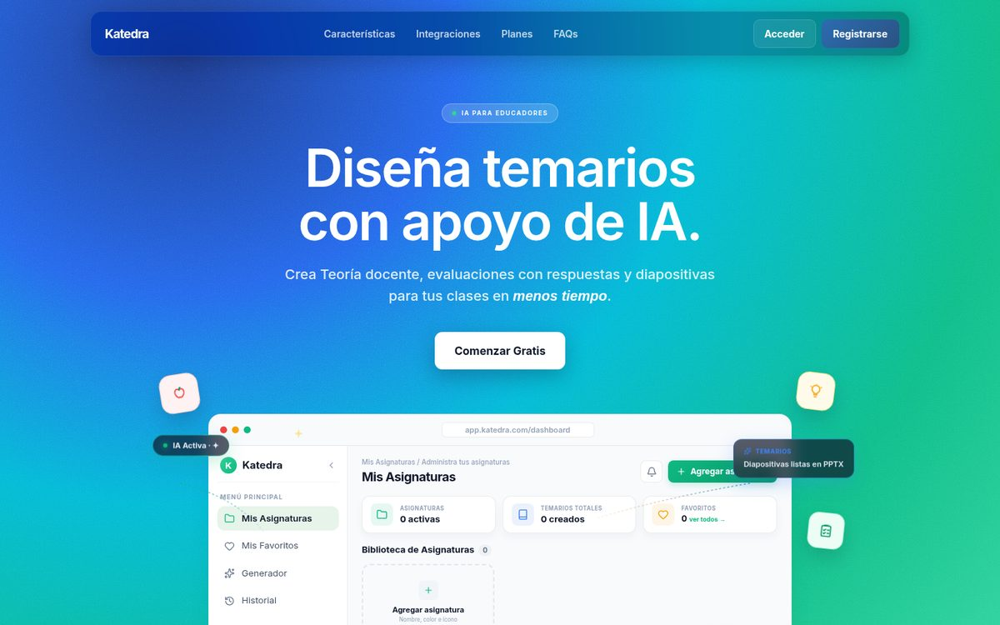

### Hi there! 👋

My name is **Saúl Alejandro**, a Full Stack Developer Jr. working with **Java (Spring Boot)** and
**JavaScript/TypeScript (React)**. I develop robust, scalable web applications with REST APIs,
relational databases and modern UI/UX design. My current project in production is called
**Katedra AI**, where I implemented the latest advances in AI and software development.

*Available for upcoming Full Stack projects.*

  
  
  
  

<a href="README.md">🇲🇽 Lee este perfil en español</a>

---

### 🚀 Katedra AI

Katedra AI is a web application with a client-server architecture and a modular monolith, built
with React and Spring Boot, that generates theory, exams and slides for teachers from a syllabus
through the integration of the OpenAI API Key via Spring AI. It includes 37 REST endpoints across 7
modules, among them authentication through OAuth2, subscriptions managed with Stripe and
role-based access control via JWT, while the Syllabus module, made up of 14 endpoints, extracts
content from files and URLs and keeps a real-time history of changes.

  

The project is backed by 404 automated tests, 336 on the backend with JUnit 5, Mockito and AssertJ,
and 68 on the frontend with Node Test, along with a documented Bruno collection. The frontend is
deployed on Vercel and consumes the backend hosted on Render through a REST API.

`React (Vercel) → REST API · JWT (Spring Boot on Render) → PostgreSQL/MySQL → OpenAI (Spring AI)`

[Demo](https://katedra-client.vercel.app) ·
[server](https://github.com/SAULALEE/katedra-server) ·
[client](https://github.com/SAULALEE/katedra-client) ·
API: requires auth, first request ~1 min (cold start)

  

### 🛠️ Stack

**Backend**
 

**Frontend**
 

**Data & infrastructure**
 

### 💼 Experience

As a Full Stack Developer Jr. at **Papalote Museo del Niño**, from January to May 2026, I built
fifteen reusable React components for an internal ERP used by more than thirty people, in addition
to running production database migrations with Prisma and NestJS. Previously, at **Tec Gurus I.T.
Quality Services**, from August to December 2025, I integrated an AI-driven content generation
system and built more than ten REST endpoints in Spring Boot, consumed from views developed in
Angular. The complete detail of my professional background is available in the
[résumé →](cv/Saul_Martinez_CV_EN.pdf)
